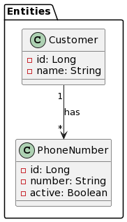
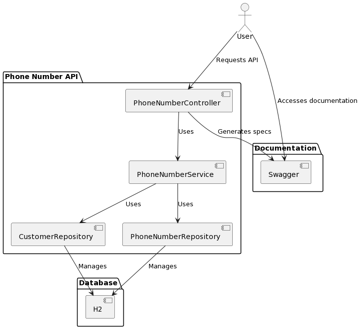

#### It is a Spring Boot application using JDK 17 and Spring Boot 2.7 version

### REST API Overview

## Get All Phone Numbers
* Endpoint: `/api/phoneNumbers`
* Method: GET
* Description: Retrieve all phone numbers.
* Response: List of phone numbers.

## Get all phone numbers of a single customer
* Endpoint: `/api/customers/{customerId}/phone-numbers`
* Method: GET
* Description: Retrieve all phone numbers associated with a specific customer.
* Parameters: customerId - ID of the customer. 
*  Response: List of phone numbers associated with the customer.

## Activate a phone number
* Endpoint: `/api/phone-numbers/{phoneNumberId}/activate`
* Method: POST
* Description: Activate a phone number.
* Path Parameter: Phone number to activate.
* Response: Updated phone number details.

## Build and Run the Project
* Build the project using Maven
* `mvn clean install`
* Run the project using the Spring Boot Maven plugin
* `mvn spring-boot:run`
* Import the Postman collection from project Path
`https://github.com/amarpreetbhatia/phonenumbers/blob/main/postman_collection/telstra_phonenumbers_api.postman_collection.json`
* View Swagger Specs API
`http://localhost:8080/swagger-ui.html`
* Data Model used

* Context Diagram

